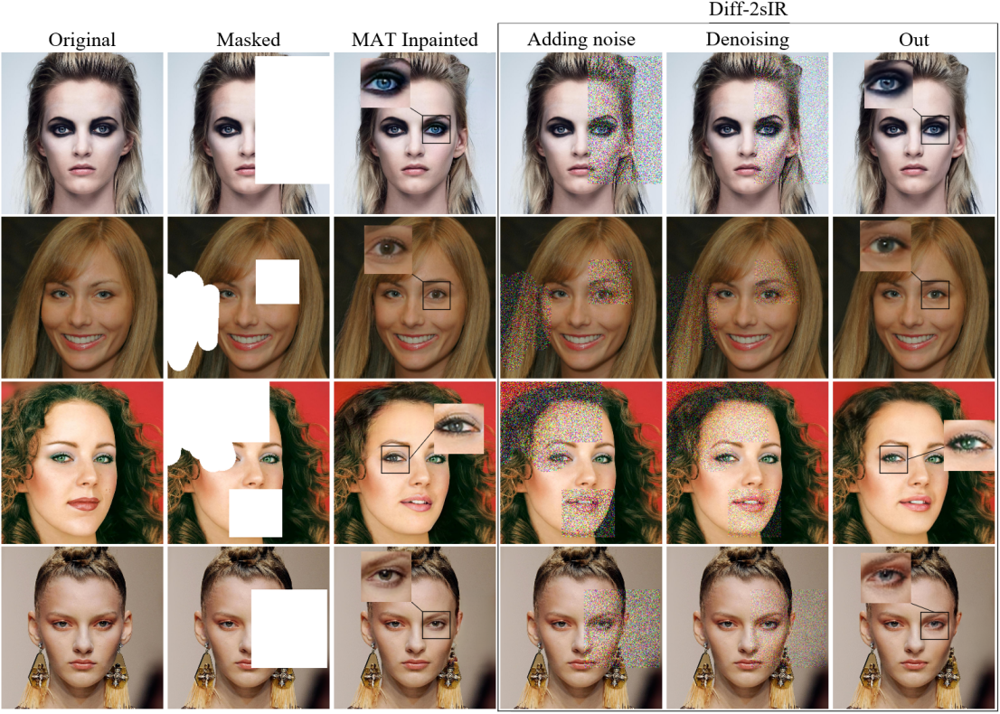

# Diff-2sIR
论文《Diff-2sIR: Diffusion-Based Refinement Two-Stage Image Restoration Model》的实施。


## 1. 环境准备

  - Ubuntu 22.04 LTS
  - Python 3.10

1) 克隆仓库
    ```shell
    git clone https://github.com/daxuZ/Diff-2sIR.git
    ```
    
2) 创建环境
   ```shell
   conda create -n diff_2sir python=3.10
   ```

   ```shell
   pip install -r requirements.txt
   ```

## 2. 文件准备

下载  [权重文件和CelebA-HQ](https://pan.baidu.com/s/1LTjlCdN7Gc64nn6n87KRhw?pwd=daxu) 数据集、[掩码](https://mycuhk-my.sharepoint.com/:f:/g/personal/1155137927_link_cuhk_edu_hk/EuY30ziF-G5BvwziuHNFzDkBVC6KBPRg69kCeHIu-BXORA?e=7OwJyE) 数据集(来源于 [MAT](https://github.com/fenglinglwb/MAT) )

将权重文件放置到 ./experiments/checkpoint 目录下，对应的掩码数据集放置到 ./datasets/celebahq_masks_256_large 和 ./datasets/celebahq_masks_256_small，首先使用其他模型进行修复，以MAT为例，使用一一对应的掩码和测试集图像进行第一阶段修复，得到修复结果后，生成.flist文件如下：

  - MAT_out.flist

    ./dataset/mat_out/162775.png

    ./dataset/mat_out/162778.png

    ./dataset/mat_out/162781.png

    ...

  - celebahq_test.flist

    ./dataset/celebahq_test/162775.png

    ./dataset/celebahq_test/162778.png

    ./dataset/celebahq_test/162781.png

    ...

  - celebahq_train.flist

    ./dataset/celebahq_train/000004.png

    ./dataset/celebahq_train/000009.png

    ./dataset/celebahq_train/000014.png

    ...

    
    
